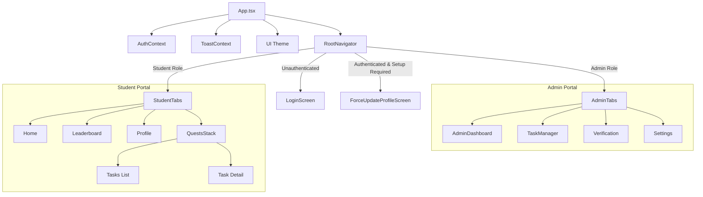
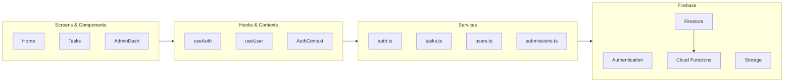

# Project Architecture & Dependency Graph

## 🗺️ High-Level Navigation & Auth Flow

## 🛠️ Service & Data Layer

## 📁 Directory Structure Overview
- **`src/`**: Primary application source.
    - **`components/`**: Reusable UI elements (Buttons, Cards, Modals).
    - **`services/`**: Firebase API wrappers and business logic.
    - **`screens/`**: Feature-specific views divided by user role.
    - **`navigation/`**: Routing configuration.
- **`functions/`**: Server-side logic (TypeScript).
- **`myApp/`**: Independent Expo Router prototype.
